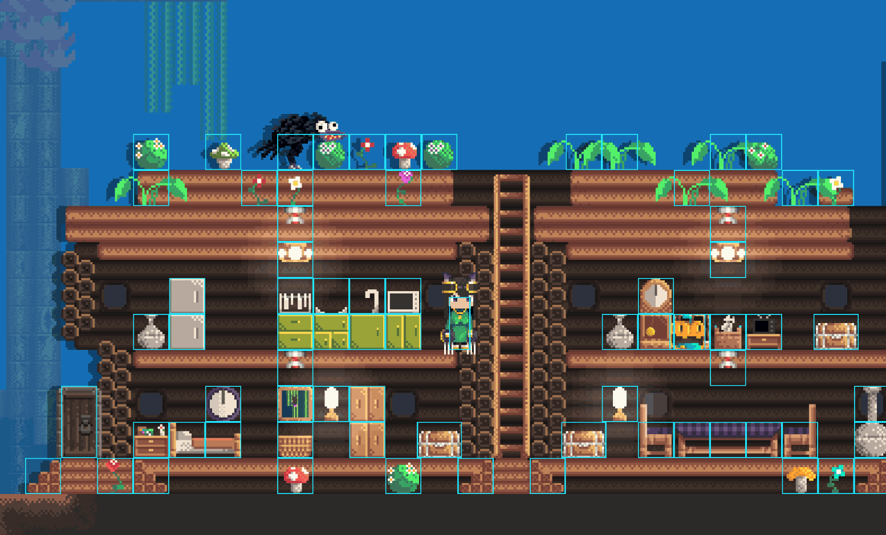
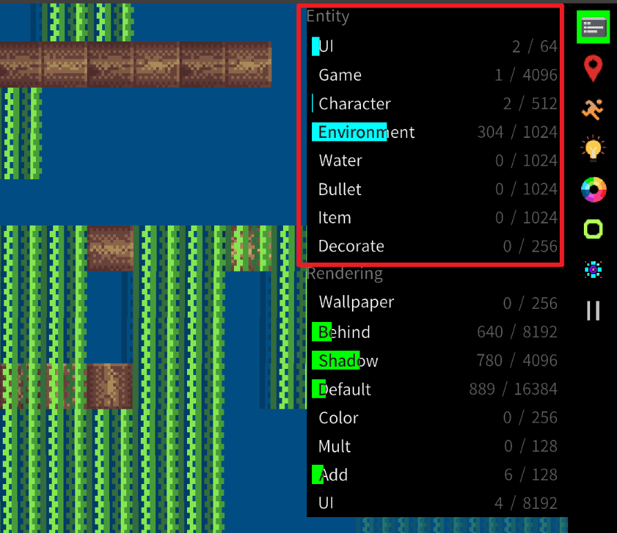

# Entity

An **Entity** is the core carrier of game logic in AngeliA. Within a map, most objects that can interact with the player exist in the form of entities, such as crates, characters, bullets, and more. You can use the **Entity Debugger** to test activated entities on the stage.




### Entity Layers

Entities on the stage are organized into different layers: `UI`, `Game`, `Character`, `Environment`, `Water`, `Bullet`, `Item`, and `Decorate`. You can retrieve the layer value using `EntityLayer.XXX`.  

The profiler located at the top-right corner of the game window displays the number of entities currently spawned in the stage. The progress bar indicates how close this number is to the maximum allowed.



You can set the maximum capacity for each entity layer using the `EntityLayerCapacity` attribute:

```csharp
using AngeliA;

[assembly: EntityLayerCapacity(EntityLayer.GAME, 1024)]
[assembly: EntityLayerCapacity(EntityLayer.DECORATE, 256)]
```


### Callback Functions

Entity classes receive system events through **callback functions**. You can override these functions to handle the corresponding events. The available callbacks are as follows:

- **`OnActivated`**: Invoked once when the entity is loaded into the stage.

- **`OnInactivated`**: Invoked once when the entity is removed from the stage.

- **`FirstUpdate`**: The first update cycle, typically used to initialize physics colliders.

- **`BeforeUpdate`**: The second update cycle, used to process physics movement logic. (By this point, all entities in the stage have completed `FirstUpdate`.)

- **`Update`**: The third update cycle, used for physics updates and entity-specific behavior.

- **`LateUpdate`**: The final update cycle, used for rendering the entity.
