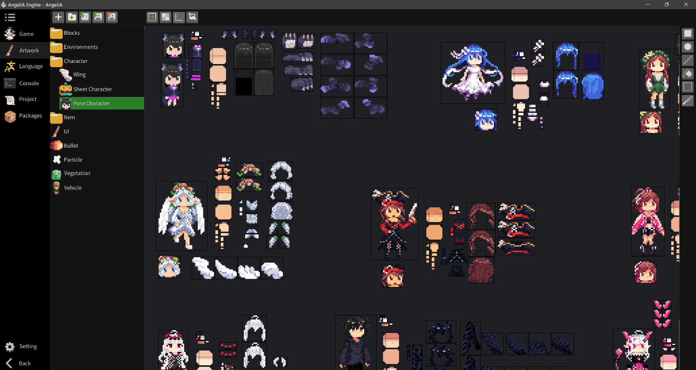

# Introduction

> **Disclaimer:**
> This documentation were translated with help of AI and may contain minor inaccuracies. We appreciate your understanding and welcome any suggestions for improvement.

Welcome to the AngeliA Engine documentation. AngeliA is a free and open-source 2D game engine designed to deliver a high-quality development experience on PC. With it, you can create your own games or applications and export them as standalone executable files (.exe). Below is an overview of the engine's core features:

### Level Editing

The engine includes a built-in level editor that allows you to design open-world environments. You can instantly playtest the part you're working on during the editing process. The workflow feels like playing a sandbox game—intuitive, creative, and fun.

### Frame-by-Frame Debugging

AngeliA offers frame-by-frame debugging, allowing you to precisely inspect and test gameplay. From fine-tuning character animations to nailing tricky jumps in challenging levels, you have complete control over every frame. Whether you're verifying animation smoothness or checking the accuracy of physics interactions, this feature gives you the precision needed to polish gameplay and enhance the player experience.

### Programming Language

The AngeliA Engine is itself built using C#, a modern and elegant programming language. You can create custom `Entity` classes and visually place them in the level editor. The engine includes a rich library of built-in components—such as conveyors, springs, and one-way platforms. You can extend these by writing subclasses and adjusting a few parameters to rapidly prototype and iterate on your game ideas.

### Physics System

AngeliA features a custom-designed physics system optimized for retro-style games. It's simple, performant, and faithfully reproduces the movement and feel of classic pixel-era gameplay. Elements like jump hang-time, inertia during sliding, and collision feedback have all been finely tuned to deliver top-notch control and responsiveness.

### Pixel Art Editor

The engine comes with a built-in pixel art editor, making it easy to create and manage the art assets for your game. All visual changes are applied in real time—no need to recompile—greatly accelerating the development cycle and creative workflow. The editor supports a wide range of game-related configurations, including collision shapes for tiles, auto-tiling rules, and adaptive sprite setups for characters.

### License Compliance

This project is developed solely by [Moenen](https://github.com/Mo-enen) and is licensed under the [MIT License](https://github.com/Mo-enen/AngeliA/blob/main/License.txt). You are free to use it for almost any purpose, but you must give proper credit as outlined in the [License Compliance Guide](https://mo-enen.github.io/AngeliA-Document/docs/2-comply-with-the-license.html).
