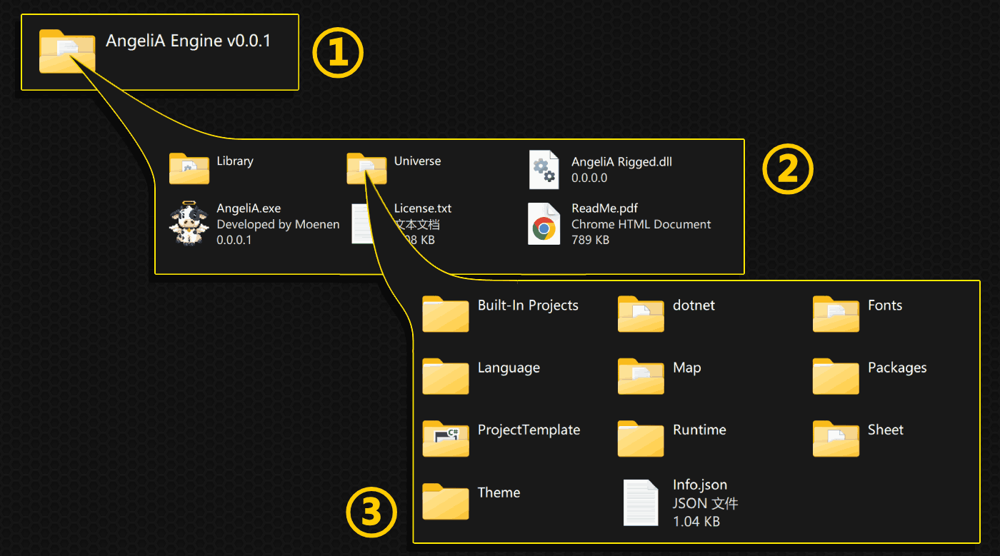
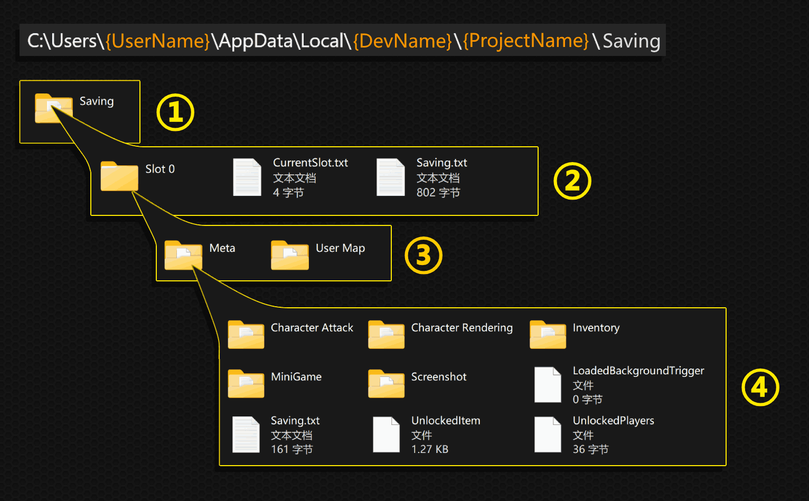

# File Layout

This section provides an overview of the file structure used by AngeliA on disk, divided into three categories: Engine Program, Game Projects, and User Save Data. For more detailed explanations, please refer to the relevant documentation sections.

### Engine Program

① **Engine Folder**: Contains all the files required to run the engine. You can move this folder freely without affecting the engine’s functionality.

② **Inside the Engine Folder**:
- 📁`Library`: AngeliA Engine is itself built as an AngeliA game. Like any AngeliA project, this folder contains `.dll` files that provide game-specific functionality. The engine’s core features are embedded in the `exe` file.
- 📁`Universe`: Resource folder including configuration files, UI assets, and background launcher components required by the engine.
- 🐄`AngeliA.exe`: Entry point for launching the engine.
- 📄`License.txt`: Software license for using the engine.
- 📄`ReadMe.pdf`: Engine overview (same as the GitHub project homepage).

③ **Inside the Resource Folder**:
- 📁`Built-In Projects`: Sample projects bundled with the engine to help you learn how to use it. These are automatically added to the project list on first launch. Deleting them does not affect engine functionality.
- 📁`dotnet`: Contains the .NET SDK (provided by Microsoft) used to compile your C# code into `.dll` files.
- 📁`Fonts`: Fonts used by the engine’s UI.
- 📁`Language`: Localization files for the engine UI. You can modify these to support additional languages.
- 📂`Map`: Auto-generated folder. It will be created regardless of whether your project uses maps.
- 📁`Packages`: Built-in extension packages. Choose what you need based on the type of game you're developing.
- 📁`ProjectTemplate`: Default template for new projects. You can customize it to define the structure of newly created projects.
- 📁`Runtime`: Background process used to run user-created games and exchange input/output data through shared native memory.
- 📁`Sheet`: Art assets used by the engine UI.
- 📁`Theme`: Additional UI themes for the engine.
- 📄`Info.json`: Engine project configuration file (as an AngeliA game).

### Game Projects

① **Your Game Project Folder**

② **Inside the Project Folder**:
- 📁`Build`: Compiled `.dll` files generated by the user.
- 📁`Entry`: Project entry files used when running the game from an IDE.
- 📁`lib`: Contains referenced AngeliA framework and extension package `.dll` files.
- 📁`obj`: Auto-generated by the .NET framework.
- 📁`src`: Contains the user’s source code files.
- 📁`Universe`: The project’s resource folder (see below).
- 🖼️`Icon.ico`: Project icon used both inside the engine and in the final `.exe`.
- 🖼️`Icon.png`: PNG version of the icon, not used by the engine—safe to delete.
- 📋`*.csproj`: C# project file.
- 📋`*.sln`: C# solution file.

③ **Inside the Resource Folder (`Universe`)**:
- 📁`Audio`: Music and sound effects. Access path via `Universe.BuiltIn.MusicRoot` and `Universe.BuiltIn.SoundRoot`.
- 📁`Language`: Localization text files. Access path via `Universe.BuiltIn.LanguageRoot`.
- 📁`Sheet`: Art files for the project. Access path via `Universe.BuiltIn.SheetRoot`.
- 📁`Fonts`: Fonts used in the project. Access path via `Universe.BuiltIn.FontRoot`.
- 📁`Meta`: Custom metadata. Access path via `Universe.BuiltIn.UniverseMetaRoot`.
- 📁`Map`: Built-in map files for the project (not modifiable by players). Access path via `Universe.BuiltIn.BuiltInMapRoot`.
- 📄`Info.json`: Project configuration including project name, author, version, etc. Access via `Universe.BuiltInInfo`.

### User Save Data

① **Save Root Directory**: All save-related data generated by a project is stored here. Access path via `Universe.SavingRoot`.

② **Inside the Save Root Directory**:
- 📁`Slot 0`: Slot 0 save data. Users can create and select save slots. New slots will be named "Slot 1", "Slot 2", and so on. Access current slot path via `Universe.SlotRoot`.
- 📄`CurrentSlot.txt`: Stores the current slot number. Access via `Universe.CurrentSavingSlot`.
- 📄`Saving.txt`: Global save data shared across all slots. When using the `Saving` class, use `SavingLocation.Global` to write to this file.

③ **Inside a Save Slot Folder**:
- 📁`Meta`: User-defined save data. Access path via `Universe.SlotMetaRoot`.
- 📁`User Map`: Player-modified map files. Access via `Universe.SlotUserMapRoot`.

④ **Inside the Info Folder**:
- 📁`Character Attack`: Character attack configuration.
- 📁`Character Rendering`: Character rendering configuration.
- 📁`Inventory`: Inventory data, including equipped items and chest contents.
- 📁`MiniGame`: Reward data from mini-games.
- 📁`Screenshot`: Screenshots taken in-game using render cells. Call `CellScreenshotSystem.RequireTakeScreenshot(yourGlobalRange);` to take a screenshot.
- 📑`LoadedBackgroundTrigger`: Stores active circuit system triggers. See the `CircuitSystem` class for details.
- 📄`Saving.txt`: Local save data for the slot. Use `SavingLocation.Local` to save to this file. This data is isolated and will not appear when switching to another slot.
- 📑`UnlockedItem`: IDs of unlocked items.
- 📑`UnlockedPlayers`: IDs of unlocked playable characters.
