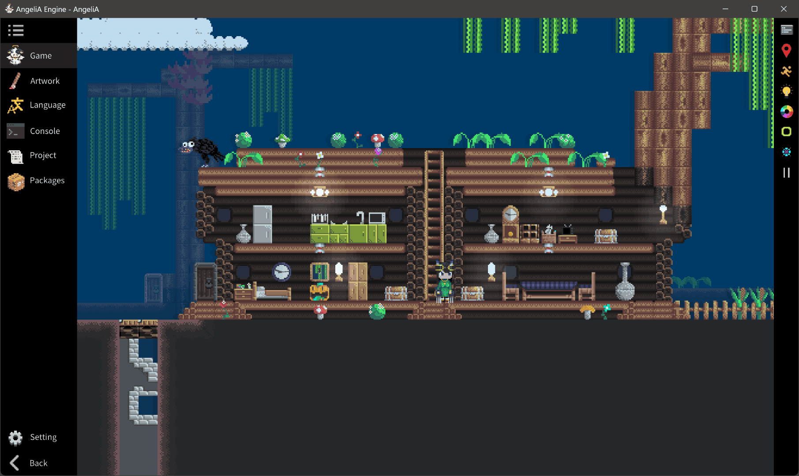
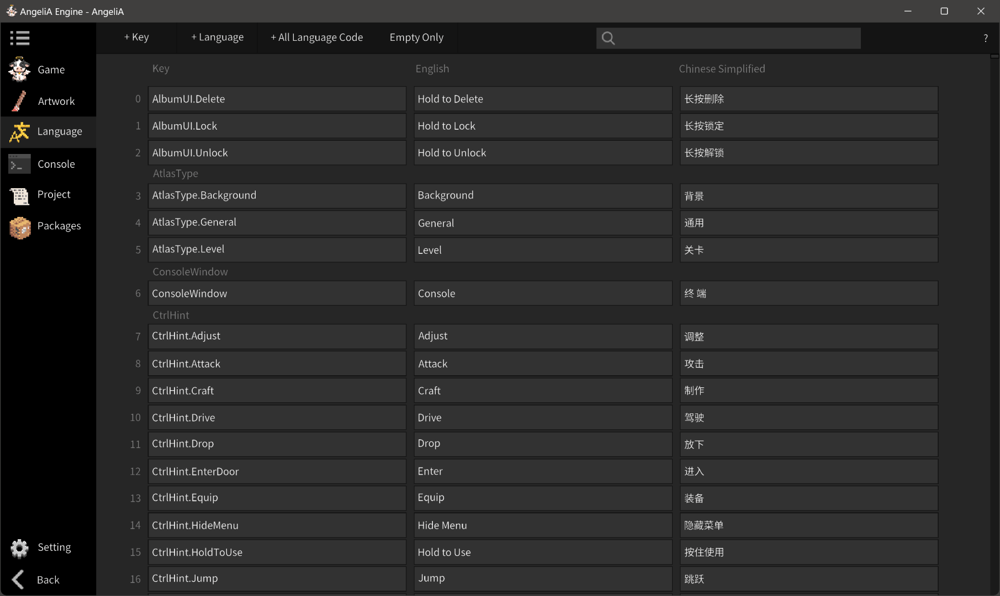
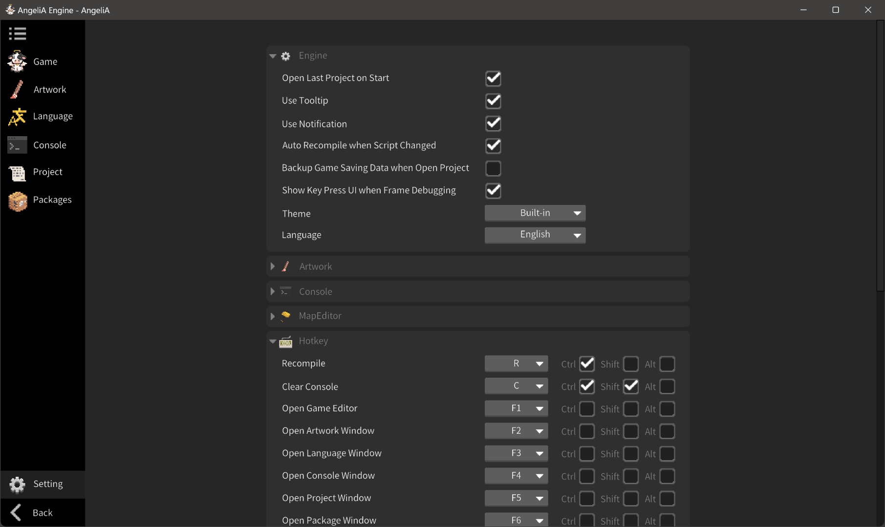

# Engine Windows

This section provides a brief overview of the editor windows available in the AngeliA Engine. After opening a game project, you can access any of the editor windows from the sidebar on the left. The engine supports only one editor window open at a time. All available editors are listed in the left-hand sidebar. For detailed instructions on how to use each window, please refer to the following chapters.

### Game Window

This window is used to design levels and playtest the user-developed game. To display game content successfully, the project must be free of compilation errors. When the game window is open, a dedicated toolbar appears on the right side, offering helpful features such as frame-by-frame debugging, collision shape display, and entity dragging with the mouse.

### Artwork Editor

This window is used to manage and create pixel tiles needed for your game. Nearly all visual elements—whether it's a tree stump, a character's head, or a ladder segment—are rendered using tiles. On the left is the customizable tileset list for organized tile management. The main area in the center allows you to draw, rename, create new tiles, and set auto-tiling rules. All changes are applied immediately upon saving—no need to recompile the game.

### Language Window

This window enables you to provide UI text in multiple languages for your game. You can define the supported languages and manually fill in the translation entries. The game code retrieves localized text using the Key value shown in the first column on the left. Use `Language.Get(ange_hash_of_key);` to get the localized string for the currently selected language.

### Console Window

This window displays log messages, runtime exceptions, and compile-time errors. Use `Debug.Log(your_content);` to print messages to the console.

### Project Settings

This window allows you to configure current project settings such as project name, developer name, version number, and more. All settings are saved within the project folder and only apply to the currently opened project. Buttons at the top allow you to recompile the game or build it into a standalone executable.

### Packages Window

This window allows you to add or remove extension packages from your game. You can also export the current project as a package to reuse or share it across other projects.

### Engine Settings

This window is used to configure settings related to the engine itself—for example, whether to automatically reopen the last used project on startup, the UI language of the engine, or the keybindings for various features. These settings only affect the engine’s behavior and do not impact any project content.

