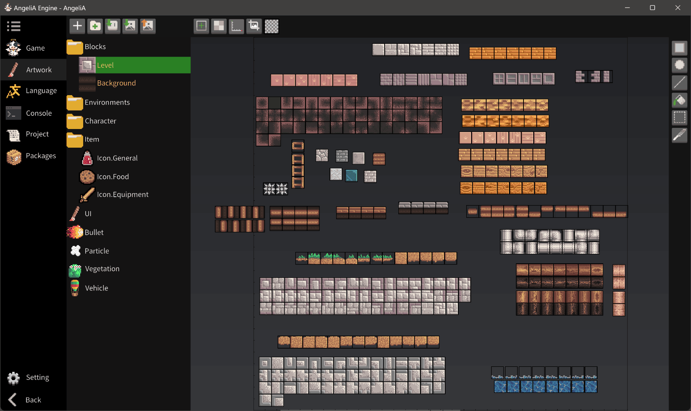
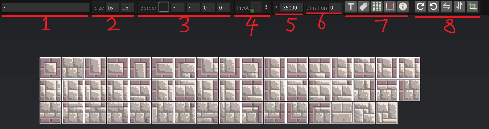

# Pixel Artwork

This section provides a brief overview of the built-in Pixel Art Editor in the AngeliA engine. The editor operates on data stored in the file `Universe\Sheet\Game Sheet.sheet` within the current project directory. This file uses a custom, lossless binary format designed for AngeliA to store pixel-style art assets along with all associated metadata—such as tile tags, borders, and more.

The editor interface is divided into four main sections: the atlas list on the left, the main editing area in the center, the toolbar at the top, and the drawing tools on the right.

### Tiles and Atlases

Atlases can be created and modified by the user and organized into folders for better management. Atlases come in three types: **Normal**, **Level**, and **Background**. Tiles within a Level-type atlas are treated as "Level Tiles" that can be used in map editing. Background-type atlases work similarly. To change an atlas type, right-click the target atlas in the list and select the desired type from the context menu.

The central editing area displays all tiles in the selected atlas. When you select the "Tile Tool" from the right-hand toolbar, you can click and drag to select one or more tiles. When tiles are selected, the top toolbar switches to the interface shown below:

① **Tile Name**:  
Each tile must have a unique name, not shared with any tile in the same or other atlases. If multiple tiles are selected, the input box will display `*`, but you can still enter a base name. The system will auto-generate names like “Name 0”, “Name 1”, “Name 2”, etc. These tiles will be treated as a tile group, usable for animation and auto-tiling.

② **Tile Size**:  
Width and height in pixels. Editable.

③ **Tile Borders**:  
From left to right: left, right, bottom, and top borders. Used for 9-slice rendering or to define custom collision areas for level tiles.

④ **Tile Pivot**:  
Defines the alignment reference point. When rendered in-game by position, the pivot point aligns to the specified location in code. Modifying the pivot of level or background tiles affects their rendering position on the map.

⑤ **Tile Z-Index**:  
Determines the rendering order. This value can be overridden in your game code.

⑥ **Animation Frame Duration**:  
Duration per frame in tiles, in units of frames.

⑦ **General Tools (left to right)**:
- **Trigger**:  
  Marks the selected tile as a trigger. Triggers do not collide with entities but are still loaded into the physics system, allowing them to trigger specific gameplay logic (e.g., heal the player on contact or define detection zones).

- **Tag**:  
  Adds logic tags to selected tiles. See [Enum Tag](https://mo-enen.github.io/AngeliA/api/AngeliA.Tag.html) for details.

- **Auto-Tile Rules**:  
  Defines auto-tiling behavior in the level editor (see below). The engine evaluates rules in order by tile group. If the current tile arrangement matches a rule, the corresponding tile is used for rendering.  
  The example rule below requires left and right neighbors to share the same ID, and top/bottom neighbors to differ. Diagonal neighbors are ignored in this case (but diagonal rules are supported).

  

- **Delete selected tiles** (Shortcut: `Del`)  
- **Export tile info** (only in Debug Mode)

⑧ **Transform Tools (left to right)**:
- Rotate clockwise  
- Rotate counterclockwise  
- Flip horizontally  
- Flip vertically  
- Auto-crop transparent edges

### Drawing

Drawing is only allowed within tiles. With a drawing tool selected, hold down the left mouse button and drag to draw pixels. Right-click to pick a color from the tile.

Drawing tools from top to bottom:

- **Rectangle Tool**: Hold `Shift` to draw a square, `Alt` to draw a hollow rectangle.
- **Ellipse Tool**: Hold `Shift` to draw a circle, `Alt` to draw a hollow ellipse.
- **Line Tool**: Click and drag to draw straight lines.
- **Bucket Tool**:  
  - Fills all adjacent pixels of the same color.  
  - Drag to fill with a gradient.  
  - Hold `Ctrl` and click to replace all pixels of the same color in the tile (not limited to adjacent pixels).
- **Pixel Selection Tool**:  
  - Select pixels for moving, deleting, or copying.  
  - Supports selecting across multiple tiles.
- **Tile Tool**:  
  - Select, copy, or delete tiles.  
  - Modify tile properties.

