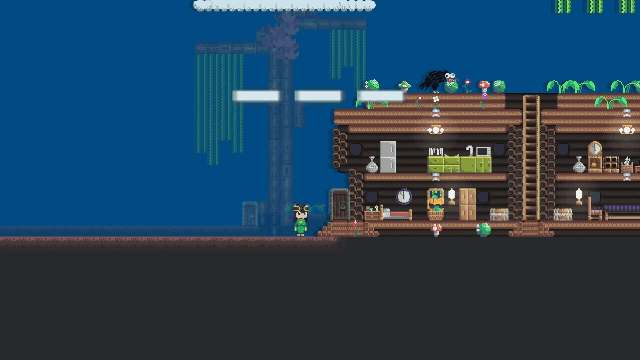
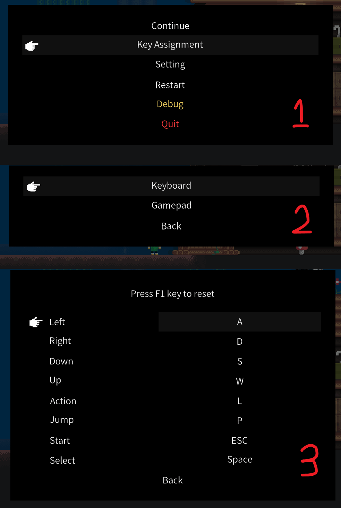

# Input


AngeliA provides a built-in **frame-based input system**. You can detect whether a specific key on the keyboard, mouse, or gamepad is pressed during the current frame, and also retrieve the global coordinates of the mouse pointer.


### Keyboard Input

The following code displays the pressed state of specific keys at the top of the screen:

```csharp
using AngeliA;

namespace Test;

public static class InputTest {

	[OnGameUpdateLater(4096)]
	internal static void OnGameUpdateLater () {

		bool holdingQ = Input.KeyboardHolding(KeyboardKey.Q);
		bool holdingW = Input.KeyboardHolding(KeyboardKey.W);
		bool holdingE = Input.KeyboardHolding(KeyboardKey.E);

		GUI.Label(
			Renderer.CameraRect.TopHalf(),
			$"{(holdingQ ? "Q" : "-")}{(holdingW ? "W" : "-")}{(holdingE ? "E" : "-")}",
			GUI.Skin.AutoCenterLabel
		);
	}

}
```

Output:




### Game Keys 

The engine provides **8 predefined game keys**, corresponding to common controls on an NES-style controller: `Left`, `Right`, `Down`, `Up`, `Action`, `Jump`, `Select`, and `Start`.  
Players can assign both keyboard and gamepad buttons to these game keys.  
Use `Input.GameKeyHolding(GameKey.XXX);` to check if a specific game key is pressed in the current frame.





### Mouse Position

The following code draws an entity icon at the current mouse pointer position:

```csharp
using AngeliA;

namespace Test;

public static class InputTest {

	[OnGameUpdateLater(4096)]
	internal static void OnGameUpdateLater () {
		var pos = Input.MouseGlobalPosition;
		Renderer.Draw(BuiltInSprite.ICON_ENTITY, new IRect(pos.x, pos.y, 512, 512));
	}

}
```

Output:


