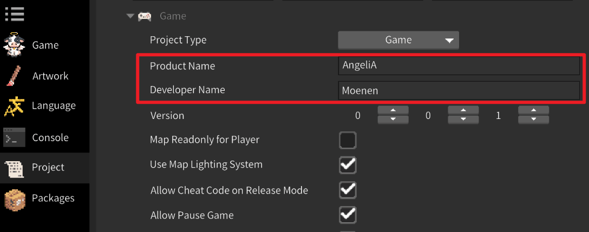

# Save System


Player save data is stored in the following directory: 
`C:\Users\{UserName}\AppData\Local\{DevName}\{ProjectName}\Saving` Here, `DevName` and `ProjectName` are defined in the engine's project settings window. 
Modifying these values will create a new save directory for the game.




### Save System Overview

The save system automatically stores **global variables** in `Saving\Saving.txt`, and **slot-specific variables** in `Saving\Slot_X\Saving.txt`. 

The following example demonstrates how to create, modify, and log three saved variables using the save system. 
`A` is a global save variable, while `B` and `C` are slot-based save variables:

```csharp
using AngeliA;

namespace Test;

public static class InputTest {

	private static readonly SavingInt DataA = new("Unique.Key.A", defaultValue: 0, SavingLocation.Global);
	private static readonly SavingBool DataB = new("Unique.Key.B", defaultValue: true, SavingLocation.Slot);
	private static readonly SavingString DataC = new("Unique.Key.C", defaultValue: "", SavingLocation.Slot);

	[OnGameInitialize]
	internal static void OnGameInitialize () {

		Debug.Log(DataA, DataB, DataC);

		DataA.Value = 5;
		DataB.Value = false;
		DataC.Value = "new value";

		Debug.Log(DataA, DataB, DataC);
	}
}
```

**First run output:**

>
> 0 True
> 5 False new value
>


**Output on the next game launch:**

>
> 5 False new value
> 5 False new value
>

