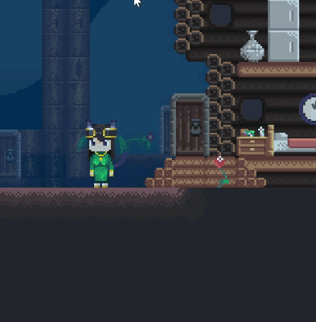

# Inventory

AngeliA engine provides a built-in inventory system. You can create classes based on `Item` class to customize your own items. Use `ItemCombination` attribute to set the crafting formular for given items.

