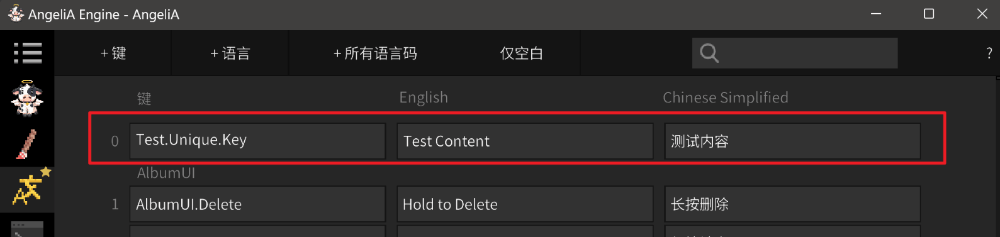

# Language


AngeliA engine provides a built-in multi-language system. You can edit multi-language content through the language window, and then use the Key string to get the content corresponding to the currently selected language.

The following code can output the language content corresponding to Test.Unique.Key



```C#
using AngeliA;

namespace Test;

public static class LanguageTest {

	// Cache the Ange Hash
	private static readonly int KeyID = "Test.Unique.Key".AngeHash();

	[OnGameInitialize]
	internal static void OnGameInitialize () {
		string content = Language.Get(KeyID);
		Debug.Log(content);
	}

}
```

Result：
> Test Content

Switch the language to Chinese and restart the game：
> 测试内容