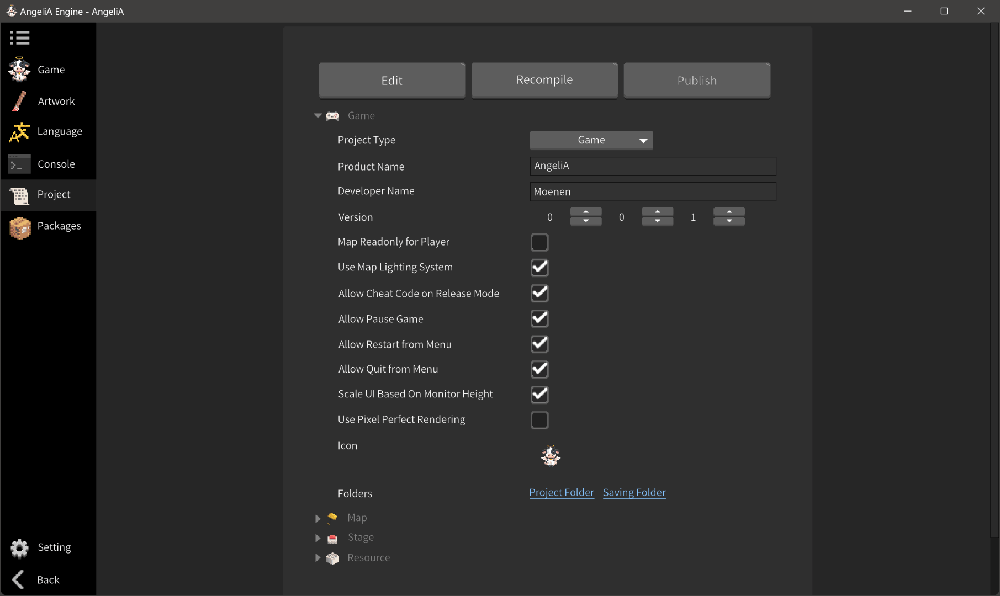

# 引擎窗口

本章将简要介绍 AngeliA 引擎中各个编辑器窗口的功能。在打开游戏工程后，您可以通过左侧边栏选择任意一个编辑器窗口以使用其提供的功能。引擎仅支持同时打开一个编辑器窗口，所有可用的编辑器窗口均列于左侧边栏。有关各窗口更详细的使用说明，请参阅后续章节。

### 游戏窗口

该窗口用于编辑关卡并试玩用户开发的游戏。要在游戏窗口中成功显示游戏内容，项目须做到无任何编译错误。打开游戏窗口后，右侧将出现专属工具栏，提供如逐帧调试、显示碰撞体、鼠标拖拽移动实体等实用功能。

 

### 美工编辑器

该窗口用于管理和创作当前游戏所需的像素图块。游戏中的几乎所有画面元素——无论是一块树桩、角色的头部，还是一节梯子——都是通过图块渲染的。窗口左侧是用户自定义的图集列表，便于对图块进行分类管理；中间的主区域用于绘制和管理具体图块，支持创建新图块、在图块中绘制、重命名图块，或为其设置自动平铺规则等操作。所有修改在保存后将即时应用于游戏，无需重新编译游戏。

 

### 多语言

该窗口用于以多种语言填写游戏所需的文字 UI 内容。您可以自定义游戏所支持的语言，并手动填写对应的翻译文本。游戏代码将通过窗口左侧第一列的 Key 值，查找并获取对应语言的翻译内容，从而实现多语言支持。使用 `Language.Get(ange_hash_of_key);`来获取用户选择的语言所对应的文本。

 

### 日志输出

该窗口显示游戏输出的文本内容、游戏运行时抛出的异常与游戏的编译错误。使用 `Debug.Log(your_content);` 来输出一行文本到日志窗口。

 

### 工程信息

该窗口用于调整当前工程的配置信息，例如工程名称、开发者名称、版本号等。所有设置将保存在游戏工程文件夹中，仅对当前打开的工程生效。窗口上方的按钮可用于重新编译游戏，或将其打包发布为最终的游戏成品。

 

### 拓展包

该窗口用于将指定的拓展包加载到游戏中或从游戏中移除。您也可以将当前游戏导出为拓展包，以便在其他项目中复用和共享。

 

### 引擎设置

该窗口用于调整与引擎程序本身相关的设置，例如是否在启动时自动打开上次使用的工程、引擎界面的显示语言，以及各项功能的快捷键配置等。这些设置仅影响引擎的使用体验，不会对任何游戏工程的内容产生影响。

 

