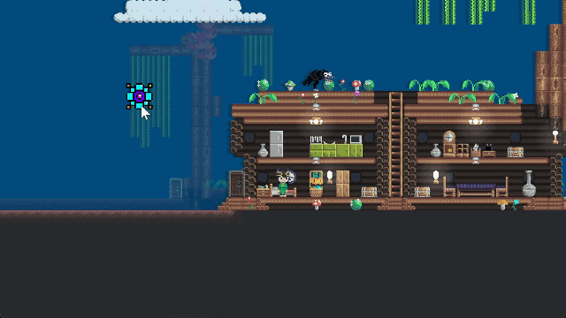

# 输入


AngeliA 提供内置的基于帧的用户输入系统，您可以获取当前帧是否按下给定的键盘按键、鼠标按键、手柄按键等，也可以获取当前帧鼠标指针的全局位置坐标。


### 键盘输入

以下代码会在屏幕上方显示给定按键的按下状态：

```C#
using AngeliA;

namespace Test;

public static class InputTest {

	[OnGameUpdateLater(4096)]
	internal static void OnGameUpdateLater () {

		bool holdingQ = Input.KeyboardHolding(KeyboardKey.Q);
		bool holdingW = Input.KeyboardHolding(KeyboardKey.W);
		bool holdingE = Input.KeyboardHolding(KeyboardKey.E);

		GUI.Label(
			Renderer.CameraRect.TopHalf(),
			$"{(holdingQ ? "Q" : "-")}{(holdingW ? "W" : "-")}{(holdingE ? "E" : "-")}",
			GUI.Skin.AutoCenterLabel
		);

	}

}
```

运行结果：


### 游戏按键 (GameKey)

引擎提供了8个游戏按键，分别为 `Left`、`Right`、`Down`、`Up`、`Action`、`Jump`、`Select`、`Start`，意义与 NES 手柄按键相同。玩家可为游戏按键分配对应的键盘和手柄按键。使用 `Input.GameKeyHolding(GameKey.XXX);` 来获取游戏按键在当前帧的按下状态。


### 鼠标位置

以下代码将在鼠标指针处绘制一个实体图标：

```C#
using AngeliA;

namespace Test;

public static class InputTest {

	[OnGameUpdateLater(4096)]
	internal static void OnGameUpdateLater () {
		var pos = Input.MouseGlobalPosition;
		Renderer.Draw(BuiltInSprite.ICON_ENTITY, new IRect(pos.x, pos.y, 512, 512));
	}

}
```

运行结果：




