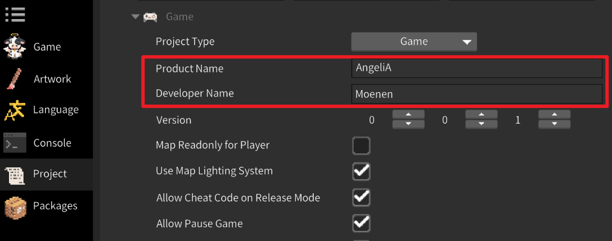

# 存档


玩家的游戏存档保存在 `C:\ Users \ {UserName} \ AppData \ Local \ {DevName} \ {ProjectName} \ Saving` 文件夹里，其中的 `DevName` 和 `ProjectName` 可在引擎程序的工程窗口中设置，修改后将重新创建游戏存档。




### 存档系统

存档系统会将全局变量自动保存至 Saving 文件夹下的 `Saving.txt` 文件中，槽位变量保存至 `Saving\Slot_X\Saving.txt` 中。以下代码通过存档系统创建、修改并输出了三个变量，A为全局存档，B和C为槽位存档：

```C#
using AngeliA;

namespace Test;

public static class InputTest {

	private static readonly SavingInt DataA = new("Unique.Key.A", defaultValue: 0, SavingLocation.Global);
	private static readonly SavingBool DataB = new("Unique.Key.B", defaultValue: true, SavingLocation.Slot);
	private static readonly SavingString DataC = new("Unique.Key.C", defaultValue: "", SavingLocation.Slot);

	[OnGameInitialize]
	internal static void OnGameInitialize () {

		Debug.Log(DataA, DataB, DataC);

		DataA.Value = 5;
		DataB.Value = false;
		DataC.Value = "new value";

		Debug.Log(DataA, DataB, DataC);

	}

}
```

首次运行结果：

>
> 0 True
> 5 False new value
>


再次启动游戏后的运行结果：

>
> 5 False new value
> 5 False new value
>


