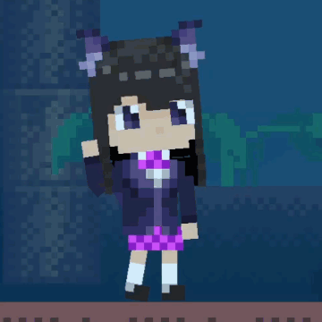

# 角色动画


AngeliA 引擎提供内置的角色动画系统，动画由代码生成，您可以编写继承自 `PoseAnimation` 类的代码来为角色创作动画。在 Debug 模式游戏进行时输入 `playeranimation` 作弊码可开启下图中的调试界面。


### 自定义动画

以下代码强制当前玩家角色使用测试动画：

```C#
using AngeliA;

namespace Test;

public class PoseAnimation_Test : PoseAnimation {

	// Cache TypeID for ManualPoseAnimate
	public static readonly int TYPE_ID = typeof(PoseAnimation_Test).AngeHash();

	// Force Current Player Use This Testing Animation
	[OnGameUpdate]
	internal static void OnGameUpdate () {
		var player = PlayerSystem.Selecting;
		if (player == null || player.Rendering is not PoseCharacterRenderer rendering) return;
		rendering.ManualPoseAnimate(TYPE_ID, duration: 1);
	}

	// Animate Logic
	public override void Animate (PoseCharacterRenderer renderer) {
		base.Animate(renderer);

		renderer.Head.Rotation = -5;
		renderer.Head.X -= 16;
		renderer.Body.X -= 16;
		renderer.Hip.X -= 16;
		renderer.UpperLegL.X -= 8;

		FrameworkUtil.ResetShoulderAndUpperArmPos(renderer);

		// Arm
		renderer.UpperArmL.Height = UpperArmL.SizeY;
		renderer.UpperArmR.Height = UpperArmR.SizeY;
		renderer.LowerArmL.Height = LowerArmL.SizeY;
		renderer.LowerArmR.Height = LowerArmR.SizeY;
		renderer.UpperArmL.LimbRotate(60 + Game.GlobalFrame.PingPong(30) - 15);
		renderer.UpperArmR.LimbRotate(-5);
		renderer.LowerArmL.LimbRotate(120);
		renderer.LowerArmR.LimbRotate(0);
		renderer.HandL.LimbRotate(0);
		renderer.HandR.LimbRotate(1);

		// Leg
		renderer.UpperLegL.LimbRotate(10);
		renderer.LowerLegL.LimbRotate(0);
		renderer.FootL.LimbRotate(-FacingSign);

		// Grab Rot
		renderer.HandGrabScaleL.Override(0);
		renderer.HandGrabScaleR.Override(0);

		// Z
		renderer.UpperArmL.Z = 30;
		renderer.UpperArmR.Z = 30;
		renderer.LowerArmL.Z = 31;
		renderer.LowerArmR.Z = 31;
		renderer.HandL.Z = 32;
		renderer.HandR.Z = 32;

	}

}
```

运行效果：




