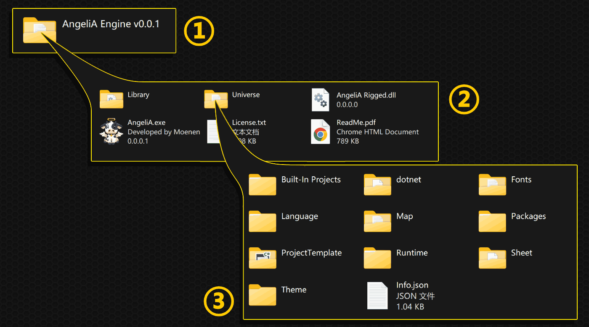

# 文件结构

本章将为您简述 AngeliA 在硬盘中存储的所有文件的作用，分为引擎程序、游戏工程和用户存档三部分，更详细的解释请参考后续文档内容。

### 引擎程序

 

① 引擎程序文件夹，运行引擎需要的全部文件都在这个文件夹里，移动此文件夹的位置不会影响引擎的使用；

② 引擎程序文件夹内部
- 📁Library：AngeliA 引擎也是一款 AngeliA 游戏，就像所有的 AngeliA 游戏一样，Library 文件夹内的 dll 文件包含着此程序特有的功能，引擎提供的通用功能内嵌在 exe 文件里；
- 📁Universe：资源文件夹，包含着引擎程序需要的配置、美工、后台游戏启动器等；
- 🐄AngeliA.exe：引擎程序入口；
- 📄License.txt：使用引擎时需要遵守的软件许可证；
- 📄ReadMe.pdf：引擎简介，同 GitHub 项目首页；

③ 资源文件夹内部
- 📁Built-In Projects：引擎自带的游戏工程，用于更好的学习引擎的使用方法。这些工程会在第一次打开引擎时自动加入到工程列表中，删除这些文件不会影响引擎的功能；
- 📁dotnet：由微软团队开发的dotnet SDK，用于将用户编写的 C# 代码编译为 dll 文件以供引擎运行使用；
- 📁Fonts：引擎本身UI所用的字体文件；
- 📁Language：引擎本身UI所用的多语言支持文件，您可以自行修改其内容以支持更多语言；
- 📂Map：此文件夹并未被引擎使用，AngeliA 框架无论项目是否使用地图都会自动创建 Map 文件夹；
- 📁Packages：引擎自带的拓展包，用户可根据自己开发的游戏类型选择需要的拓展包；
- 📁ProjectTemplate：新工程模板，您可以修改里面的文件来自定义新建工程的内容；
- 📁Runtime：让引擎在后台进程运行用户开发的游戏，并使用共享原生内存来传递输入与输出的信息；
- 📁Sheet：引擎本身UI所用的美术资源；
- 📁Theme：引擎的额外主题皮肤；
- 📄Info.json：引擎作为 AngeliA 游戏的项目配置；

### 游戏工程

 

① 用户开发的游戏工程文件夹

② 工程文件夹内部
- 📁Build：存放用户编译生成的dll文件；
- 📁Entry：此工程的入口，仅供 IDE 运行游戏时使用；
- 📁lib：存放工程引用的 AngeliA 框架 dll 文件和拓展包 dll 文件；
- 📁obj：由 .net 框架生成；
- 📁src：存放用户编写的代码文件；
- 📁Universe：此工程的资源文件夹（详见③）；
- 🖼️Icon.ico：工程的图标文件，是引擎内部显示的图标，也是最终发布出的 exe 文件所使用的图标；
- 🖼️Icon.png：图标文件的 png 版本，未被引擎使用，删除该文件不影响引擎功能；
- 📋*.csproj：工程对应的 C# 工程文件；
- 📋*.sln：工程对应的 C# 解决方案；

③ 资源文件夹内部
- 📁Audio：存放工程所需的音乐音效文件，使用 `Universe.BuiltIn.MusicRoot`和  `Universe.BuiltIn.SoundRoot`来获取此文件夹的路径；
- 📁Language：存放支持多语言所需的文本文件，使用 `Universe.BuiltIn.LanguageRoot` 来获取此文件夹的路径；
- 📁Sheet：存放工程的美工文件，使用 `Universe.BuiltIn.SheetRoot` 来获取此文件夹的路径；
- 📁Fonts：存放工程的字体文件，使用 `Universe.BuiltIn.FontRoot` 来获取此文件夹的路径；
- 📁Meta：存放由用户自定义的文本信息，使用 `Universe.BuiltIn.UniverseMetaRoot` 来获取此文件夹的路径；
- 📁Map：存放工程自带的地图文件，这里的地图文件不会被玩家修改。使用 `Universe.BuiltIn.BuiltInMapRoot` 来获取此文件夹的路径；
- 📄Info.json：工程的配置设置，包含如工程名，开发者名，工程版本等内容。使用 `Universe.BuiltInInfo` 来获取此文件的内容；

### 用户存档

 

① 存档根目录，一个 AngeliA 工程由用户生成的所有存档内容都保存在这个文件夹里。，使用 `Universe.SavingRoot`  来获取这个文件夹的路径；

② 存档根目录内部
- 📁Slot 0：第0号存档槽位，用户可创建并选择存档槽位，新的槽位将命名为 “Slot 1”、“Slot 2” 等。使用 `Universe.SlotRoot`  来获取当前选择的槽位文件夹路径；
- 📄CurrentSlot.txt：当前选择的存档槽位编号，使用 `Universe.CurrentSavingSlot`来获取当前选择的存档编号；
- 📄Saving.txt：全局设置存档内容，所有存档槽位共享这里的内容，使用 Saving 类时`SavingLocation.Global` 用于定义全局存档信息；

③ 存档槽位内部

- 📁Meta：用户自定义的存档内容，使用 `Universe.SlotMetaRoot` 来获取此文件夹路径；
- 📁User Map：存放玩家游玩过的关卡文件，玩家对关卡的修改将保存在这些文件里，使用 `Universe.SlotUserMapRoot` 来获取此文件夹路径；

④ 信息文件夹内部
- 📁Character Attack：存放角色的攻击相关的配置信息；
- 📁Character Rendering：存放角色渲染相关的配置信息；
- 📁Inventory：存放物品栏内的物品信息，包含角色的装备、指定位置的宝箱里的物品等；
- 📁MiniGame：迷你游戏的奖励信息；
- 📁Screenshot：游戏内部的截图功能，使用渲染Cell保存信息，使用 `CellScreenshotSystem.RequireTakeScreenshot(yourGlobalRange);` 来对游戏进行截图；
- 📑LoadedBackgroundTrigger：用于保存电路系统激活的后台触发器位置，详见 `CircuitSystem` 类；
- 📄Saving.txt：槽位内部存档内容，使用 `SavingLocation.Local` 来把存档内容存入此文件中。当玩家更换槽位后，这里的存档信息将不会出现在新的槽位里；
- 📑UnlockedItem：玩家解锁过的物品ID；
- 📑UnlockedPlayers：玩家解锁过的可控角色ID；

