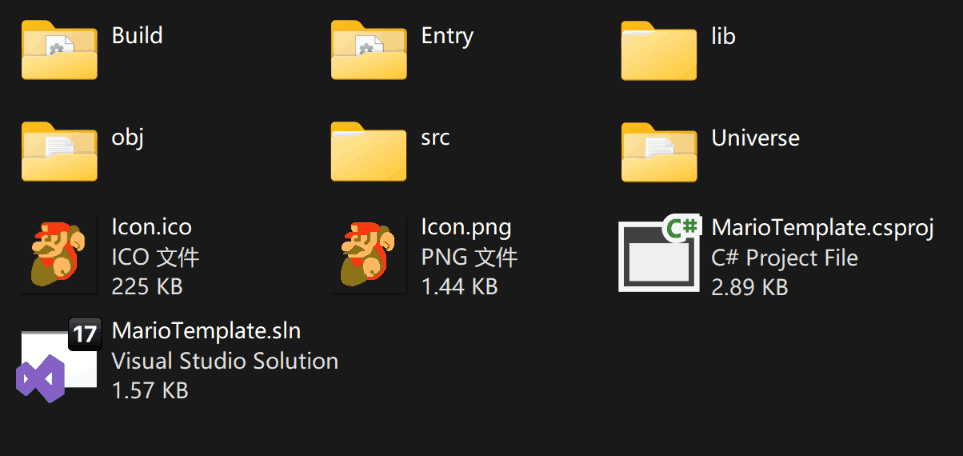

# 代码


AngeliA 工程本质上是一个 C# 工程，推荐使用 Visual Studio 或 Visual Studio Code 来编写代码。您可以根据需要修改 `.csproj` 文件以自定义工程配置，引擎不会对该文件进行修改。建议将您编写的所有代码放置于 `src` 文件夹中。如果您希望在项目中添加额外的文件夹，请将其置于 `Universe` 文件夹内。您可以通过 `Universe.BuiltIn.UniverseRoot` 获取该文件夹的路径。




### 静态事件

为工程内的任意类的一个静态函数添加 `[OnGameInitialize]` 标签后，这个函数会在游戏初始化时被调用，`[OnGameUpdate]` 则会让函数每帧都被调用一次，全部静态事件标签请看 [速查表](https://mo-enen.github.io/AngeliA/docsCN/4-cheat-sheet.html) 章节。

```c#
using AngeliA;

namespace Test;

public static class Test {

    [OnGameInitialize]
    internal static void OnGameInitialize () {
        Debug.Log("Game Init");
    }

    [OnGameUpdate]
    internal static void OnGameUpdate () {
        Debug.Log("Game Update", Game.GlobalFrame);
    }

}
```

运行结果

> Game Init
> Game Update 0
> Game Update 1
> Game Update 2
> Game Update 3
> ...


### 渲染图块

以下代码会在画面正中间绘制一个系统自带的 Entity 图标，绘制内容不会保留到下一帧，所以需要每帧都进行绘制。

```C#
using AngeliA;

namespace Test;

public static class Test {

	private static readonly int SpriteID = "Icon.Entity".AngeHash();

	[OnGameUpdate]
	internal static void OnGameUpdate () {
		int x = Renderer.CameraRect.CenterX();
		int y = Renderer.CameraRect.CenterY();
		Renderer.Draw(SpriteID, new IRect(x, y, 512, 512));
	}

}
```

运行结果（裁剪后画面）

 


### 载入实体

以下代码会在鼠标点击时载入一个测试实体，实体在载入后将留在舞台上，直到移出画面范围外才会被自动卸载，您也可以使用 `entity.Active = false;` 来手动卸载实体。

```C#
using AngeliA;

namespace Test;

public class TestRigidbody : Rigidbody {
    
	// Cache the Type ID for Spawn the Entity
	public static readonly int TYPE_ID = typeof(TestRigidbody).AngeHash();
	public override int PhysicalLayer => PhysicsLayer.ENVIRONMENT;

	[OnGameUpdate]
	internal static void OnGameUpdate () {
         // Handle Mouse Click
		if (Input.MouseLeftButtonDown) {
			var mousePos = Input.MouseGlobalPosition;
			Stage.SpawnEntity(TYPE_ID, mousePos.x, mousePos.y);
		}
	}

	public override void LateUpdate () {
		base.LateUpdate();
         // Render the Entity
		Renderer.Draw(BuiltInSprite.ICON_ENTITY, base.Rect);
	}

}
```

运行结果（裁剪后画面，加速播放）

 


