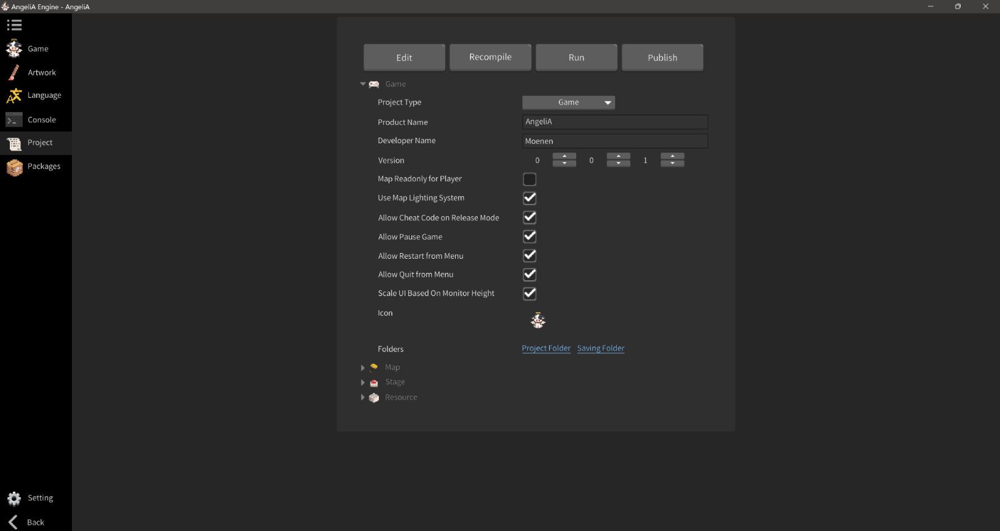

#  AngeliA Engine

A 2D game engine focused on open-world platformer games, built with C#.

## Features

- **Seamless Playtesting**: The built-in map editor is specifically designed for platformer games, allowing you to playtest while editing the map. The engine supports open-world-style maps without boundaries.
- **Integrated Game Window**: Run your game directly within the engine. No need to launch a separate window every time.
- **Built-in Pixel Art Editor**: A dedicated pixel art editor designed for creating and managing sprite sheets. Supports importing assets from Aseprite.
- **PC-Only**: Currently, the engine and the games it produces are PC only. The implementation is based on Raylib. More platforms will be support in the future.

## Download & Setup

- Download the latest version from the [Release](https://github.com/Mo-enen/AngeliA/releases) section, extract the file and you're ready to go!

## Community & Support

-  Discord [AngeliA Official](https://discord.gg/JVTQcev3P3)
-  YouTube [Moenen](https://www.youtube.com/@game.angelia)
-  BiliBili [楠瓜Moenen](https://space.bilibili.com/11318413)

## Documentation & API Reference

- [Documentation](https://mo-enen.github.io/AngeliA/docs/introduction.html) | [API Reference](https://mo-enen.github.io/AngeliA/api/AngeliA.html)
- Documentations are still under construction... 🏗️

## Screenshots

## Contributors

 

###### More features and improvements are coming soon. Stay tuned :)